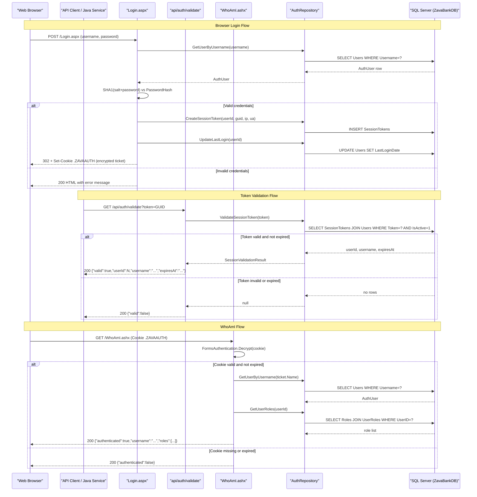

# API & Service Communication Contracts

ZavaAuthGateway exposes four HTTP endpoints — two ASP.NET Web Forms pages (browser login/logout) and two ASHX HTTP handlers (token validation and identity) — all running as a single self-contained service with no inter-service communication.

## Service Catalog

| Service | Port | Category | Purpose |
|---|---|---|---|
| ZavaAuthGateway | 8080 (Docker / xsp4) | API Layer | Centralized authentication gateway; handles browser-based login/logout and provides REST-style token validation and identity endpoints for downstream services |

## API Endpoints Inventory

| Service | Method | Path | Request | Response |
|---|---|---|---|---|
| ZavaAuthGateway | GET/POST | `/Login.aspx` | Form fields: `txtUsername`, `txtPassword` (HTML form POST) | HTML page; sets `.ZAVAAUTH` cookie on success, redirects to `Default.aspx` |
| ZavaAuthGateway | GET | `/Logout.aspx` | `.ZAVAAUTH` cookie (browser) | Clears cookie; redirects to `Login.aspx?loggedOut=1` |
| ZavaAuthGateway | GET | `/Default.aspx` | `.ZAVAAUTH` cookie (browser) | HTML landing page; redirects unauthenticated users to `Login.aspx` |
| ZavaAuthGateway | GET | `/api/auth/validate` | Query param `token` or header `X-Session-Token` | JSON: `{"valid":true,"userId":N,"username":"...","expiresAt":"..."}` or `{"valid":false}` |
| ZavaAuthGateway | GET | `/WhoAmI.ashx` | `.ZAVAAUTH` cookie | JSON: `{"authenticated":true,"username":"...","displayName":"...","sessionToken":"...","roles":[...]}` or `{"authenticated":false}` |
| ZavaAuthGateway | GET | `/health` | — | Plain text `OK` (200) |

## Management & Observability Endpoints

| Service | Endpoint | Notes |
|---|---|---|
| ZavaAuthGateway | `GET /health` | Custom liveness endpoint; returns plain-text `OK` — no dependency checks, no JSON, no framework health-check integration |

No metrics exporters, tracing instrumentation, or Swagger/OpenAPI specifications are configured.

## DTOs & Contracts

The application uses two internal sealed classes as service-level data models — they are not serialized over the wire but serve as internal contracts between the data access layer and the HTTP handlers:

- **`AuthUser`** — represents a user record returned by `AuthRepository.GetUserByUsername`; used as an internal request/response type within the application (never directly JSON-serialized)
- **`SessionValidationResult`** — represents a validated session token record with user identity and expiry; returned by `AuthRepository.ValidateSessionToken` and used by `ApiAuthValidateHandler` to build its JSON response

All JSON responses are manually constructed via string concatenation with `HttpUtility.JavaScriptStringEncode` for escaping — there is no JSON serialization library (no `System.Text.Json`, no `Newtonsoft.Json`, no Jackson). There are no OpenAPI/Swagger specifications, protobuf schemas, or GraphQL schemas.

## Communication Patterns

**Synchronous only.** The application makes no outbound HTTP calls and uses no message brokers, queues, or event-driven patterns. All communication is synchronous and intra-process: HTTP handlers interact directly with `AuthRepository`, which issues blocking ADO.NET calls to SQL Server.

**Service discovery:** None. The SQL Server connection is resolved from environment variables (`DB_HOST`, `DB_PORT`, `DB_NAME`, `DB_USER`, `DB_PASSWORD`) or from `web.config` `connectionStrings`. No service registry is used.

**Resilience policies:** None. There are no retry policies, circuit breakers, timeouts, or bulkhead patterns configured. A SQL Server connectivity failure will propagate as an unhandled exception.

**Startup dependency chain:** The application container must be able to reach SQL Server before accepting traffic; no readiness probes or startup wait mechanisms are configured.

**Security posture:**
- **Authentication:** Browser flows use ASP.NET Forms Authentication (`.ZAVAAUTH` encrypted cookie). The `/api/auth/validate` endpoint accepts a raw session token via query string or `X-Session-Token` header and validates it against `SessionTokens` in the database. The `/WhoAmI.ashx` endpoint validates the `.ZAVAAUTH` Forms Auth cookie.
- **Authorization:** `web.config` denies anonymous users by default (`<deny users="?" />`); individual paths (`Login.aspx`, `Logout.aspx`, `api/auth/validate`, `health`, `WhoAmI.ashx`) are explicitly opened to all users.
- **Transport security (TLS):** No TLS termination is configured at the application level. The Docker container listens on plain HTTP port 8080; TLS would need to be provided by a reverse proxy or load balancer in front.
- **No HTTPS enforcement, CORS policy, CSRF protection, or rate limiting is configured.** The `WhoAmIHandler` adds `Access-Control-Allow-Origin: *`, permitting cross-origin requests from any origin.

## Service Technology Matrix

| Service | Web Framework | Data Access | Discovery | Gateway | Health Check | Cache | Metrics |
|---|---|---|---|---|---|---|---|
| ZavaAuthGateway | ASP.NET Web Forms + IHttpHandler (.NET Fx 4.8) | ADO.NET (SqlClient) | None — env vars | None | Custom `/health` (plain text) | None | None |

## Service Communication Sequence

