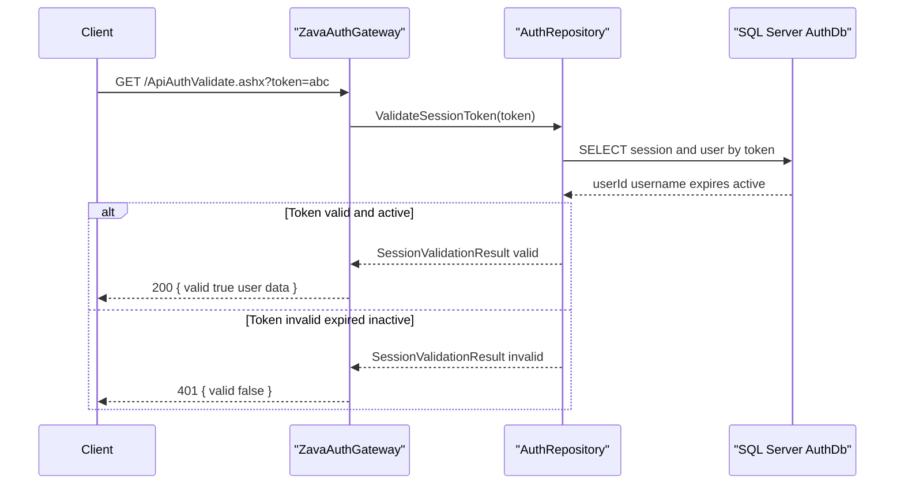

# API & Service Communication Contracts

The API surface is small and primarily consists of handler-based GET endpoints plus login/logout page flows. Communication is synchronous HTTP into the gateway and synchronous SQL calls to a single database.

## Service Catalog

| Service | Port | Category | Purpose |
|---|---:|---|---|
| ZavaAuthGateway | 8080 (container) | API Layer | Authentication gateway for login, identity lookup, and token validation |
| SQL Server AuthDb | N/A | Infrastructure | Persists users, roles, and session tokens |

## API Endpoints Inventory

| Service | Method | Path | Request Type | Response Type |
|---|---|---|---|---|
| ZavaAuthGateway | GET | /WhoAmI.ashx | Cookie `.ZAVAAUTH` | JSON authenticated status, username, roles |
| ZavaAuthGateway | GET | /ApiAuthValidate.ashx | Query `token` | JSON token validity, userId, username, expiresAt |
| ZavaAuthGateway | GET | /Health.ashx | None | Plain text `OK` |
| ZavaAuthGateway | GET/POST | /Login.aspx | Form username/password/rememberMe | HTML redirect or validation message |
| ZavaAuthGateway | GET | /Logout.aspx | Auth cookie | HTML redirect to login |

## Management & Observability Endpoints

| Service | Endpoint | Custom Metrics (if any) |
|---|---|---|
| ZavaAuthGateway | /Health.ashx | None detected |

## DTOs & Contracts

Contract models are mostly implicit JSON payloads produced by handlers rather than dedicated DTO classes. `SessionValidationResult` acts as an internal service-level contract for token validation output, while handler responses define gateway-level JSON contracts.

## Communication Patterns

All communication is synchronous: clients call gateway endpoints over HTTP, and gateway code performs immediate SQL lookups/updates through `AuthRepository`. No async messaging, service discovery, retries, or circuit breakers are implemented. Security posture is cookie-based forms authentication for protected pages/handlers, with public access explicitly allowed for `Login.aspx`, `Health.ashx`, and `ApiAuthValidate.ashx`; HTTPS/TLS enforcement is not configured in source.

## Service Technology Matrix

| Service | Web | Data Access | Discovery | Gateway | Actuator | Cache | Metrics |
|---|---|---|---|---|---|---|---|
| ZavaAuthGateway | ASP.NET Web Forms + IHttpHandler | ADO.NET SqlClient | None | Yes | Custom `/Health.ashx` | None | None |

## Service Communication Sequence

