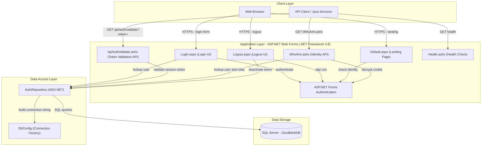
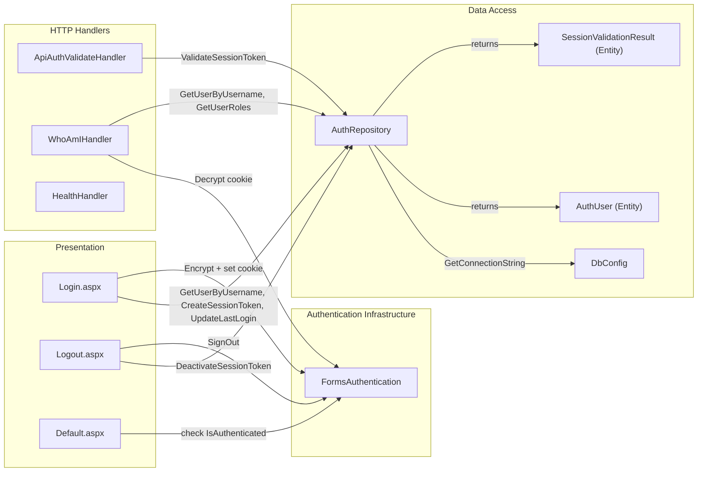

# Architecture Diagram

ZavaAuthGateway is an ASP.NET Web Forms application (.NET Framework 4.8) that provides centralized authentication and session management for the ZavaBank platform, exposing both browser-based login flows and REST-style HTTP handler endpoints for token validation.

## Application Architecture

### Technology Stack Summary

| Layer | Technology | Version | Purpose |
|---|---|---|---|
| Presentation | ASP.NET Web Forms | .NET Framework 4.8 | Browser-based login/logout UI pages |
| API Endpoints | ASP.NET IHttpHandler | .NET Framework 4.8 | REST-style handlers for token validation and identity |
| Authentication | ASP.NET Forms Authentication | .NET Framework 4.8 | Cookie-based session management (.ZAVAAUTH cookie) |
| Data Access | ADO.NET (System.Data.SqlClient) | .NET Framework 4.8 | Direct SQL queries against SQL Server |
| Data Storage | SQL Server | 2019+ (Docker) | User accounts, roles, and session tokens |
| Runtime | .NET Framework | 4.8 | Application runtime |
| Container | Docker | - | Containerized deployment |

### Data Storage & External Services

The application relies on a single SQL Server database (`ZavaBankDB`) which stores user accounts (`Users`), role assignments (`Roles`, `UserRoles`), and active session tokens (`SessionTokens`). The connection string is resolved at runtime from environment variables (`DB_HOST`, `DB_PORT`, `DB_NAME`, `DB_USER`, `DB_PASSWORD`), with a fallback to the `web.config` `connectionStrings` section. No external caches, message brokers, or third-party API integrations are present.

### Key Architectural Decisions

- **Direct ADO.NET with raw SQL**: The application bypasses ORM frameworks and uses `SqlConnection`/`SqlCommand` directly, with parameterized queries for data access.
- **Forms Authentication for cross-ecosystem SSO**: The `.ZAVAAUTH` cookie carries an encrypted `FormsAuthenticationTicket` whose `UserData` field holds a raw GUID session token, allowing Java services (which cannot decrypt the cookie) to pass the token via query string to `api/auth/validate`.
- **SHA-1 salted password hashing**: Passwords are verified by computing `SHA1(salt + password)` and comparing against the stored `PasswordHash`.

## Component Relationships

### Component Inventory

| Component | Layer | Type | Responsibility |
|---|---|---|---|
| Login.aspx / Login.aspx.cs | Presentation | Web Forms Page | Renders login form; validates credentials; creates session token; sets Forms Auth cookie |
| Logout.aspx / Logout.aspx.cs | Presentation | Web Forms Page | Deactivates session token in DB; clears Forms Auth cookie; redirects to login |
| Default.aspx / Default.aspx.cs | Presentation | Web Forms Page | Post-login landing page; redirects unauthenticated users to login |
| ApiAuthValidateHandler | HTTP Handlers | IHttpHandler | Validates a session token (via query string or header) against the database; returns JSON result |
| WhoAmIHandler | HTTP Handlers | IHttpHandler | Decrypts the .ZAVAAUTH cookie and returns user identity, display name, roles, and session token as JSON |
| HealthHandler | HTTP Handlers | IHttpHandler | Returns plain-text "OK" for liveness checks |
| AuthRepository | Data Access | Repository | Encapsulates all SQL Server interactions: user lookup, role fetch, session token CRUD, last-login update |
| DbConfig | Data Access | Configuration Utility | Builds the SQL Server connection string from environment variables or web.config fallback |
| AuthUser | Data Access | Entity / DTO | Represents a user record returned from the database |
| SessionValidationResult | Data Access | Entity / DTO | Represents a validated session token result with user identity and expiry |
