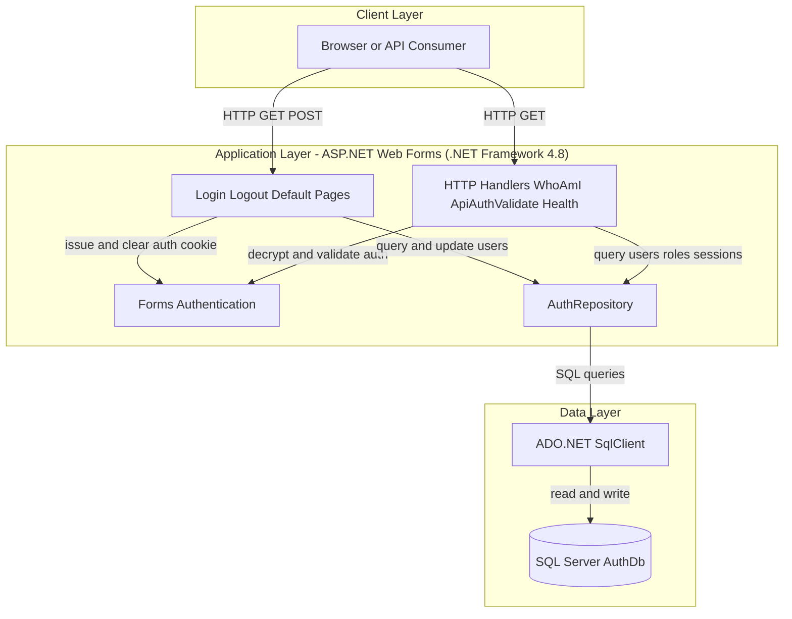
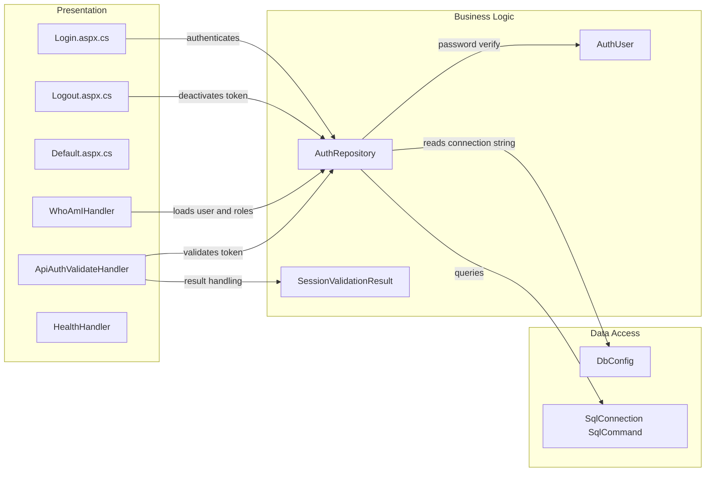

# Architecture Diagram

This application is a single-service ASP.NET Web Forms authentication gateway. It uses forms authentication and SQL Server-backed repository calls to validate users and session tokens.

## Application Architecture

### Technology Stack Summary

| Layer | Technology | Version | Purpose |
|---|---|---|---|
| Presentation | ASP.NET Web Forms / IHttpHandler | .NET Framework 4.8 | Serves login/logout pages and JSON handlers |
| Authentication | FormsAuthentication | .NET Framework 4.8 | Cookie-based authentication |
| Data Access | ADO.NET SqlClient | System.Data in framework | Executes parameterized SQL queries |
| Database | SQL Server | Configured in connection string | Stores users, roles, and session tokens |

### Data Storage & External Services

The application stores identity and session data in a SQL Server database (`AuthDb`) and does not call external service APIs.

### Key Architectural Decisions

- Uses direct repository-level SQL instead of an ORM.
- Uses cookie-based forms authentication for web and handler endpoints.
- Exposes dedicated lightweight handlers for health and token/session validation.

## Component Relationships

### Component Inventory

| Component | Layer | Type | Responsibility |
|---|---|---|---|
| Login.aspx.cs | Presentation | WebForms Page | Validates credentials and issues auth cookie |
| Logout.aspx.cs | Presentation | WebForms Page | Deactivates session token and signs out |
| WhoAmIHandler | Presentation | HTTP Handler | Returns authenticated user and roles |
| ApiAuthValidateHandler | Presentation | HTTP Handler | Validates session token and returns status |
| HealthHandler | Presentation | HTTP Handler | Returns health probe response |
| AuthRepository | Business Logic | Repository | Runs SQL for users, roles, and session tokens |
| DbConfig | Data Access | Configuration Helper | Resolves `AuthDb` connection string |
