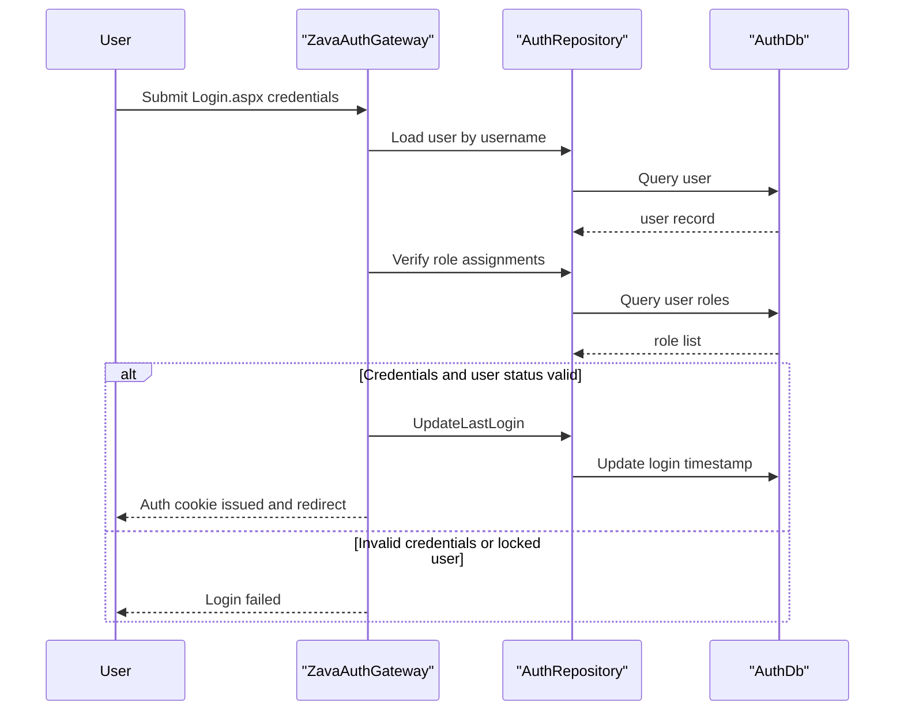

# Core Business Workflows

This application provides authentication and session validation workflows for users accessing protected resources. The main business behavior is credential verification, session lifecycle management, and identity retrieval.

## Domain Entities

| Entity | Service / Bounded Context | Description | Key Relationships |
|---|---|---|---|
| User | Authentication | Represents an account that can sign in and access protected pages | Linked to roles and session tokens |
| Role | Authorization | Represents access grouping granted to users | Assigned through user-role mapping |
| SessionToken | Session Management | Represents issued and revocable session credentials | Owned by user, validated on API calls |
| UserRole | Authorization | Mapping context between users and roles | Joins user and role ownership |

## Service-to-Domain Mapping

| Service | Domain Context | Owned Entities | External Dependencies |
|---|---|---|---|
| ZavaAuthGateway | Authentication and Session Management | User, Role, UserRole, SessionToken | SQL Server AuthDb |

## Primary Workflows

### Workflow 1: User Sign-In

1. User submits credentials to `Login.aspx`.
2. Service loads the user record and checks active/lockout status.
3. Password hash verification is performed.
4. User roles are resolved and embedded in the auth ticket.
5. Auth cookie is issued and login timestamp is updated.

### Workflow 2: API Token Validation

1. Consumer calls `ApiAuthValidate.ashx` with token query input.
2. Service validates token format and loads token+user state from persistence.
3. Decision logic checks active flag and expiration.
4. Response returns either valid user context or unauthorized result.

### Workflow 3: Sign-Out

1. User requests `Logout.aspx`.
2. Existing token is marked inactive.
3. Forms authentication sign-out clears session cookie.
4. User is redirected to login page.

## Cross-Service Data Flows

No multi-service composition pattern exists in this codebase. All workflow data retrieval and updates happen inside one gateway service against one SQL database.

## Business Workflow Sequence

## Business Rules & Decision Logic

- Login is denied if user is missing, inactive, locked out, or password hash check fails.
- Token validation requires non-empty token input with max length 512 and active, non-expired session state.
- Logout uses best-effort token deactivation before cookie sign-out.
- Authorization is configured to deny anonymous users by default, with explicit allow rules on selected endpoints.
