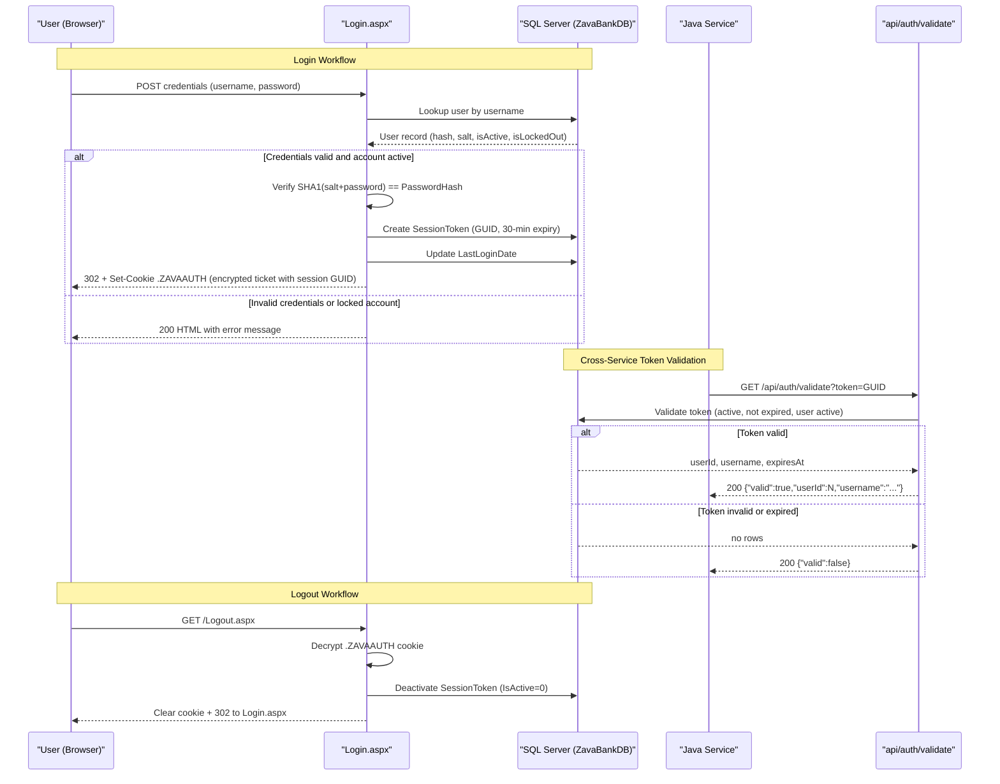

# Core Business Workflows

ZavaAuthGateway is the centralized identity and session management service for the ZavaBank platform, responsible for authenticating users, issuing session tokens, validating those tokens on behalf of downstream services, and providing identity information for cross-ecosystem single sign-on.

## Domain Entities

| Entity | Service / Bounded Context | Description | Key Relationships |
|---|---|---|---|
| User | Identity Management | A registered bank system user with credentials, account status (active/locked), and personal name | Has many Roles (via UserRoles); has many SessionTokens |
| Role | Authorization | A named permission group assigned to users (e.g., `Admin`, `Teller`, `Customer`) | Assigned to many Users via UserRoles |
| UserRole | Authorization | Join entity recording a user's role membership | Links User to Role |
| SessionToken | Session Management | An active login session represented by a GUID token with expiry, source system, client IP, and user agent | Belongs to one User; created on login, deactivated on logout |

## Service-to-Domain Mapping

| Service | Domain Context | Owned Entities | External Dependencies |
|---|---|---|---|
| ZavaAuthGateway | Identity & Session Management | User, Role, UserRole, SessionToken | SQL Server (ZavaBankDB); no upstream services consumed |

ZavaAuthGateway is a single-service bounded context. It does not consume any downstream or peer services. All other ZavaBank services (including Java applications) consume ZavaAuthGateway's endpoints to validate identity.

## Primary Workflows

### Workflow 1: User Login

A user submits credentials through the browser-based login form. The gateway looks up the user record, verifies the salted SHA-1 password hash, creates a session token, records the login timestamp, and issues an encrypted Forms Authentication cookie containing the session token in its payload. On success the browser is redirected to the landing page.

**Steps:**
1. User submits `txtUsername` and `txtPassword` via POST to `Login.aspx`.
2. Input is validated: both fields must be non-empty.
3. `AuthRepository.GetUserByUsername` fetches the user record.
4. Business rule checks: user must exist, be active (`IsActive=true`), and not be locked out (`IsLockedOut=false`).
5. Password is verified by computing `SHA1(salt + submittedPassword)` and comparing against `PasswordHash`.
6. A GUID session token is generated and persisted via `AuthRepository.CreateSessionToken` with a 30-minute expiry.
7. `AuthRepository.UpdateLastLogin` records the login timestamp.
8. A `FormsAuthenticationTicket` is created (version 2, 30-minute expiry, sliding, `UserData = sessionToken`).
9. The ticket is encrypted and written as the `.ZAVAAUTH` cookie (HttpOnly, 30-minute expiry, path `/`).
10. Browser is redirected to `Default.aspx`.

---

### Workflow 2: User Logout

A logged-in user navigates to `Logout.aspx`. The gateway reads and decrypts the Forms Auth cookie, extracts the session token from the ticket's `UserData`, deactivates that token in the database, clears the cookie, and redirects to the login page.

**Steps:**
1. Browser sends GET to `Logout.aspx` with `.ZAVAAUTH` cookie.
2. Cookie value is decrypted via `FormsAuthentication.Decrypt`.
3. If decryption succeeds and `ticket.UserData` is non-empty, `AuthRepository.DeactivateSessionToken` sets `IsActive=0` and `ExpiresAt=GETDATE()`.
4. `FormsAuthentication.SignOut()` is called.
5. An expired replacement cookie (past-dated `Expires`) is written to force browser removal.
6. Browser is redirected to `Login.aspx?loggedOut=1`.

---

### Workflow 3: Session Token Validation (Cross-Service / API)

Java or other services that cannot decrypt the `.ZAVAAUTH` cookie call `GET /api/auth/validate` with the session token to verify a user's identity before processing a request.

**Steps:**
1. Caller provides the session token via query string (`?token=`) or `X-Session-Token` header.
2. Input validation: token must be non-empty (returns 400 if missing).
3. `AuthRepository.ValidateSessionToken` queries `SessionTokens JOIN Users` where:
   - `Token` matches
   - `SessionTokens.IsActive = 1`
   - `SessionTokens.ExpiresAt > GETDATE()`
   - `Users.IsActive = 1`
4. If valid: returns `{"valid":true,"userId":N,"username":"...","expiresAt":"..."}` (HTTP 200).
5. If invalid or expired: returns `{"valid":false}` (HTTP 200).

---

### Workflow 4: Identity Lookup (WhoAmI)

Browser-based clients that hold the `.ZAVAAUTH` cookie call `GET /WhoAmI.ashx` to retrieve the full identity of the currently logged-in user, including display name, roles, and raw session token (for cross-ecosystem use).

**Steps:**
1. Browser sends GET to `WhoAmI.ashx` with `.ZAVAAUTH` cookie.
2. Cookie presence and non-emptiness is checked; missing or empty cookie returns `{"authenticated":false}`.
3. `FormsAuthentication.Decrypt` decrypts the cookie; failure or null/expired ticket returns `{"authenticated":false}`.
4. `AuthRepository.GetUserByUsername(ticket.Name)` fetches the user record; null, inactive, or locked-out user returns `{"authenticated":false}`.
5. `AuthRepository.GetUserRoles(userId)` fetches the user's role list.
6. Display name is computed as `FirstName + " " + LastName`, falling back to `Username` if blank.
7. Session token is extracted from `ticket.UserData`.
8. Returns `{"authenticated":true,"username":"...","displayName":"...","sessionToken":"...","roles":[...]}`.

## Cross-Service Data Flows

ZavaAuthGateway is the **identity authority** — it does not consume other services. The data flow is outbound only: downstream ZavaBank services (including Java applications) call `GET /api/auth/validate?token=<guid>` to verify a session token, receiving the user's ID, username, and token expiry in return. This pattern enables cross-ecosystem SSO: the Java portal passes the GUID (extracted from the `.ZAVAAUTH` cookie or a `?sessionToken=` query parameter) to the validation endpoint rather than attempting to decrypt the ASP.NET FormsAuthentication ticket directly.

There are no circuit breaker patterns, retry policies, or fallback behaviors. If ZavaAuthGateway is unavailable, calling services receive no token validation response and must handle the failure themselves.

## Business Workflow Sequence

## Business Rules & Decision Logic

**Authentication Rules:**
- Username and password fields must both be non-empty; empty submissions are rejected with a form-level error message.
- The user account must exist in the `Users` table, have `IsActive = true`, and have `IsLockedOut = false`; any failure produces a generic "Invalid username or password" message (no account-existence disclosure).
- Password verification: `SHA1(salt + submittedPassword)` must equal `PasswordHash` (case-insensitive hex comparison).

**Session Token Rules:**
- Session tokens are 32-character uppercase GUIDs (`Guid.NewGuid().ToString("N").ToUpperInvariant()`).
- Tokens are created with a 30-minute expiry (`DATEADD(MINUTE, 30, GETDATE())`); the Forms Auth ticket mirrors this expiry.
- Sliding expiration is enabled for the Forms Auth cookie (`slidingExpiration="true"`, timeout 30 minutes) — the cookie expiry is extended on each request, but the `SessionTokens` row expiry in the database is **not** updated on each request, creating a drift: the browser cookie may still be valid while the DB token has expired.
- Token validation requires the token to be active (`IsActive = 1`), not expired (`ExpiresAt > GETDATE()`), and the owning user to be active (`Users.IsActive = 1`).
- On logout, the token is explicitly deactivated (`IsActive = 0`, `ExpiresAt = GETDATE()`) — this is the only server-side session invalidation mechanism.

**Authorization Rules:**
- All paths deny anonymous users by default (`<deny users="?" />`); individual paths are explicitly opened.
- Role data is returned by `WhoAmI.ashx` for use by consuming services; ZavaAuthGateway itself does not enforce role-based access control on its own endpoints.

**Cross-Cutting Concerns:**
- **Transactions**: None. Each database operation uses an independent `SqlConnection`; there is no `TransactionScope` wrapping the login sequence (user lookup + token creation + last-login update). A partial failure mid-login could leave the DB in an inconsistent state.
- **Error handling**: Exceptions in `WhoAmI.ashx` are silently swallowed with a `catch {}` returning `{"authenticated":false}`. `Logout.aspx` similarly swallows decryption/deactivation exceptions. No structured error logging is configured.
- **Audit/logging**: No application-level logging framework is configured. Login success, failure, and logout events are not logged.
- **Security**: The Forms Auth cookie is `HttpOnly` but not `Secure` (no HTTPS enforcement); the `Access-Control-Allow-Origin: *` header on `WhoAmI.ashx` allows any origin to read identity data.
