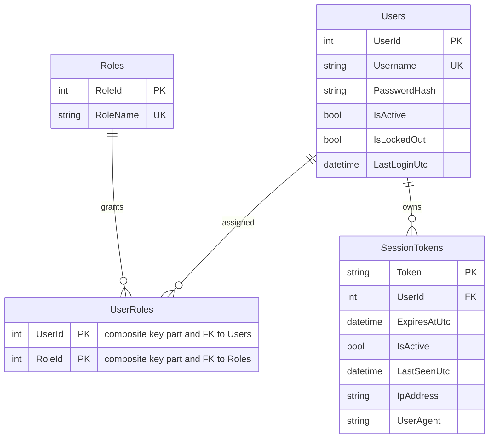

# Data Architecture & Persistence Layer

The persistence layer is SQL Server-backed and implemented with direct ADO.NET queries rather than an ORM. The data model centers on users, roles, and session token lifecycle data.

## Database Configuration

| Service/Module | DB Type | Profile | Driver | Connection | Migration Tool |
|---|---|---|---|---|---|
| ZavaAuthGateway | SQL Server | Default | System.Data.SqlClient | Named connection string `AuthDb` in `web.config` | None detected |

## Data Ownership per Service

| Service | Tables Owned | ORM Framework | Caching | Notes |
|---|---|---|---|---|
| ZavaAuthGateway | Users, Roles, UserRoles, SessionTokens | ADO.NET (no ORM) | None | Single service owns all auth-related tables |

## Entity Model

## Key Repository Methods

| Service | Repository | Notable Methods | Purpose |
|---|---|---|---|
| ZavaAuthGateway | AuthRepository (`AuthRepository.cs`) | `GetUserByUsername(string)` | Fetch active account candidate for login and identity checks |
| ZavaAuthGateway | AuthRepository (`AuthRepository.cs`) | `GetUserRoles(int)` | Resolve role names for authenticated user |
| ZavaAuthGateway | AuthRepository (`AuthRepository.cs`) | `ValidateSessionToken(string)` | Join session token and user state for API token validation |
| ZavaAuthGateway | AuthRepository (`AuthRepository.cs`) | `CreateSessionToken(...)`, `DeactivateSessionToken(string)` | Manage token lifecycle |
| ZavaAuthGateway | AuthRepository (`AuthRepository.cs`) | `UpdateLastLogin(int)` | Persist last successful login time |

## Caching Strategy

No explicit cache provider or cache-aside strategy is configured. Requests are served directly from SQL queries for each authentication and token validation operation.

## Data Ownership Boundaries

A single service and a single database are used, so ownership boundaries are centralized rather than split across services. Cross-service data access patterns are not present; all reads and writes occur directly within the gateway repository.

### Data Classification & Sensitivity

| Entity | Sensitive Fields | Classification (PII/PHI/PCI/None) | Controls in Place |
|---|---|---|---|
| Users | Username | PII | Authentication checks and active/locked state checks; no data masking/encryption settings in repository code |
| SessionTokens | Token, IpAddress, UserAgent | PII | Token validity and activity checks; no explicit encryption-at-rest config found in code |
| Roles, UserRoles | Role mappings | None | Standard relational access only |
