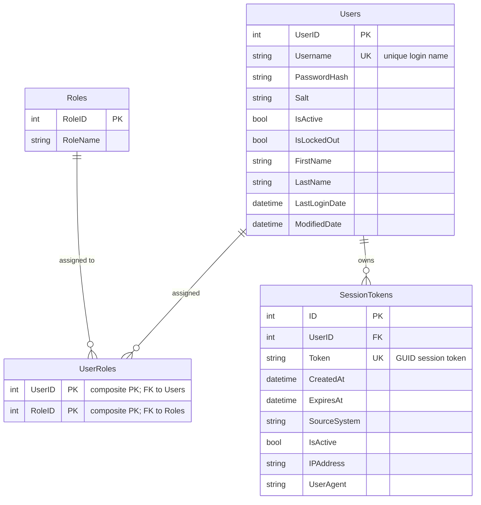

# Data Architecture & Persistence Layer

ZavaAuthGateway persists all authentication and session data in a single SQL Server database (`ZavaBankDB`) accessed through raw ADO.NET — there is no ORM layer, no migration tool, and no caching layer.

## Database Configuration

| Service/Module | DB Type | Profile | Driver | Connection | Migration Tool |
|---|---|---|---|---|---|
| ZavaAuthGateway | SQL Server | All (single config) | System.Data.SqlClient (in-box .NET Fx 4.8) | Resolved from env vars `DB_HOST`, `DB_PORT`, `DB_NAME`, `DB_USER`, `DB_PASSWORD`; falls back to `web.config` `connectionStrings["ZavaBankDb"]` | None — schema is managed externally; the application issues no DDL |

No Flyway, Liquibase, EF Migrations, or any other migration tool is configured. Schema creation and evolution are entirely external to the application.

## Data Ownership per Service

| Service | Tables Owned | ORM Framework | Caching | Notes |
|---|---|---|---|---|
| ZavaAuthGateway | Users, Roles, UserRoles, SessionTokens | None (raw ADO.NET) | None | All queries are hand-written parameterized SQL; no second-level cache or session cache is configured |

## Entity Model

> Note: Table and column names are inferred from SQL queries in `AuthRepository.cs`; no ORM schema files exist to confirm exact DDL.

## Key Repository Methods

| Service | Repository | Notable Methods | Purpose |
|---|---|---|---|
| ZavaAuthGateway | `AuthRepository` | `GetUserByUsername(string username)` | Fetches user record including password hash and salt for credential verification; returns `AuthUser` or `null` |
| ZavaAuthGateway | `AuthRepository` | `GetUserRoles(int userId)` | Returns list of role names for a user via `UserRoles` join to `Roles` |
| ZavaAuthGateway | `AuthRepository` | `CreateSessionToken(int userId, string token, string ipAddress, string userAgent)` | Inserts a new active session token with 30-minute expiry into `SessionTokens` |
| ZavaAuthGateway | `AuthRepository` | `DeactivateSessionToken(string token)` | Sets `IsActive=0` and `ExpiresAt=GETDATE()` for the given token (used on logout) |
| ZavaAuthGateway | `AuthRepository` | `ValidateSessionToken(string token)` | Queries `SessionTokens` joined to `Users` to verify the token is active, not expired, and the owning user is active; returns `SessionValidationResult` or `null` |
| ZavaAuthGateway | `AuthRepository` | `UpdateLastLogin(int userId)` | Updates `LastLoginDate` and `ModifiedDate` on the `Users` row after successful login |

All methods use `SqlConnection` + `SqlCommand` with `AddWithValue` parameterized queries. No stored procedures, no bulk operations, no transactions.

## Caching Strategy

No caching layer is configured. Every request to `/api/auth/validate` or `/WhoAmI.ashx` results in a direct synchronous SQL query to SQL Server. There are no in-memory caches, no Redis, no second-level ORM cache, and no HTTP response caching headers.

Given that session token validation is called on every cross-service API request, the absence of a short-lived in-memory or distributed cache for hot tokens is a scalability concern worth addressing during modernization.

## Data Ownership Boundaries

ZavaAuthGateway owns all four tables exclusively — there is no database-per-service isolation; the tables reside inside the shared `ZavaBankDB` database. No inter-service data access patterns are present; the application does not query any external service's tables and no other service is documented as sharing these tables, though the `ZavaBankDB` naming implies this database may be shared with other applications in the ZavaBank platform.

No CQRS, read-replica, or event-sourcing patterns are implemented. All reads and writes go through the same synchronous ADO.NET path.

### Data Classification & Sensitivity

| Entity | Sensitive Fields | Classification | Controls in Place |
|---|---|---|---|
| Users | Username, FirstName, LastName, LastLoginDate | PII | No encryption-at-rest or field-level masking configured at the application layer; password is stored as SHA-1(salt+password) — SHA-1 is considered cryptographically weak for password storage |
| SessionTokens | Token, IPAddress, UserAgent | PII (device/network identifiers) | Token is a plain GUID stored in cleartext; no encryption-at-rest configured |
| Roles / UserRoles | RoleName | None | — |

No PHI (health records) or PCI (payment card data) detected. PII is present in `Users` and `SessionTokens`; no encryption-at-rest, data masking, or field-level access controls are configured at the application level. The hardcoded `web.config` `machineKey` used for Forms Authentication ticket encryption should be treated as a credential and rotated.
