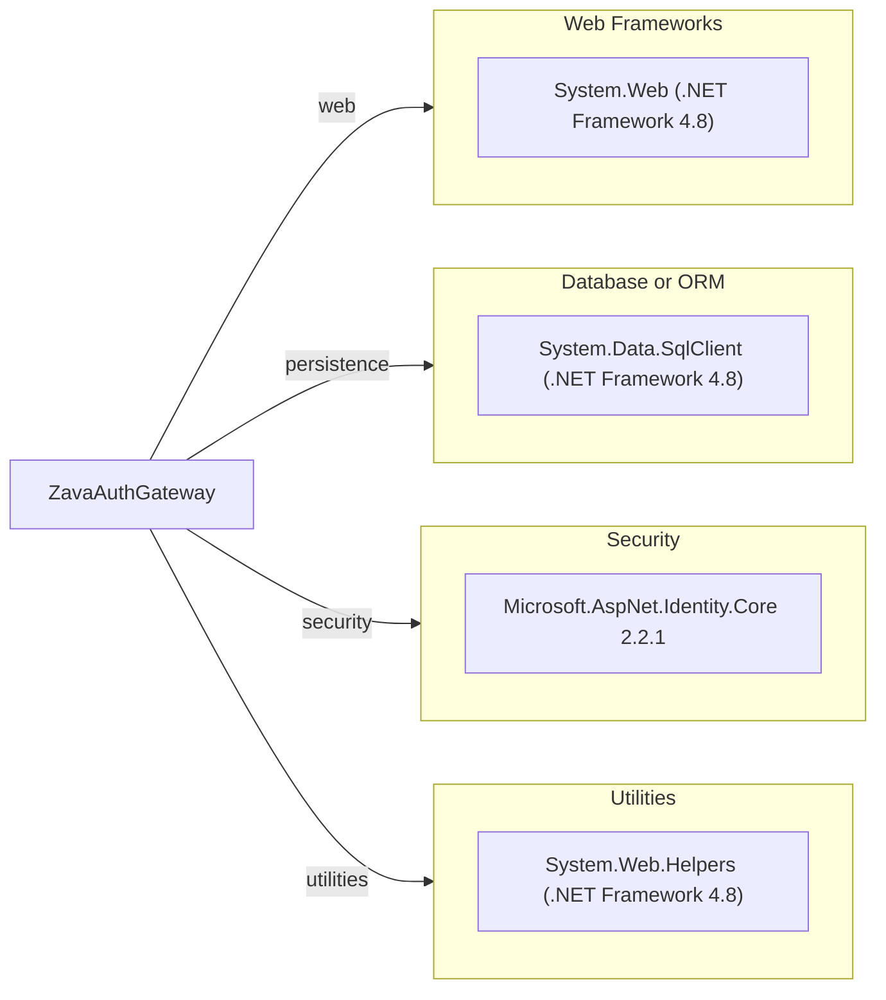

# Dependency Map

This project declares a very small dependency surface centered on ASP.NET Web Forms and SQL data access, with one explicit NuGet package.

## Dependencies

### Dependency Summary

| Category | Count | Key Libraries | Notes |
|---|---:|---|---|
| Web Frameworks | 1 | System.Web | ASP.NET Web Forms stack |
| Database or ORM | 1 | System.Data.SqlClient | Direct SQL via ADO.NET |
| Security | 1 | Microsoft.AspNet.Identity.Core 2.2.1 | Password hash verification |
| Utilities | 1 | System.Web.Helpers | Crypto helper usage |

### Version & Compatibility Risks

The project targets .NET Framework 4.8, which is legacy relative to current .NET LTS releases and can increase modernization effort. The explicit identity package version (2.2.1) is also old and should be reviewed during migration.

### Notable Observations

- No modern dependency management file such as `Directory.Packages.props` is present.
- The dependency footprint is minimal, but core platform dependency on .NET Framework is a key upgrade constraint.
- Data access relies on low-level ADO.NET rather than an ORM abstraction.

## Test Dependencies

No test dependencies detected.

Total test-scope dependencies: 0
No test framework package entries were found in project dependency files.
