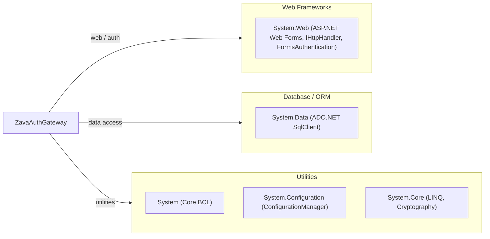

# Dependency Map

ZavaAuthGateway declares no third-party NuGet packages; all dependencies are built-in .NET Framework 4.8 BCL and ASP.NET assemblies referenced directly in the project file.

## Dependencies

### Dependency Summary

| Category | Count | Key Libraries | Notes |
|---|---|---|---|
| Web Frameworks | 1 | System.Web (.NET Framework 4.8) | Provides ASP.NET Web Forms, IHttpHandler pipeline, and FormsAuthentication — all tied to .NET Framework |
| Database / ORM | 1 | System.Data / SqlClient (.NET Framework 4.8) | Raw ADO.NET; no ORM layer; ships inside the .NET Framework |
| Utilities | 3 | System, System.Configuration, System.Core | Core BCL assemblies bundled with .NET Framework 4.8 |

### Version & Compatibility Risks

All declared dependencies are in-box .NET Framework 4.8 assemblies — there are zero third-party NuGet packages. While .NET Framework 4.8 itself receives security patches, it is the final major version of the legacy Windows-only runtime and will not receive new feature development. `System.Web` (WebForms + FormsAuthentication) is **not available on .NET 5/6/7/8/9/10** and has no direct upgrade path; migrating to modern .NET requires replacing Web Forms pages with Razor Pages or Minimal API endpoints and replacing `FormsAuthentication` with ASP.NET Core cookie authentication or token-based auth. `System.Data.SqlClient` (in-box) should be replaced with `Microsoft.Data.SqlClient` (NuGet) when targeting modern .NET. The `machineKey` element in `web.config` uses a hardcoded SHA-1 / AES key which is a known security concern.

### Notable Observations

- **No third-party NuGet packages**: The entire dependency surface consists of .NET Framework BCL assemblies, which minimizes supply-chain risk but also means the application relies exclusively on framework-level APIs that are absent from modern .NET.
- **System.Web is the primary migration blocker**: `System.Web.UI.Page` (Web Forms), `IHttpHandler`, and `FormsAuthentication` are all `System.Web` types with no equivalent in .NET Core/5+; each must be rewritten rather than ported.
- **SHA-1 password hashing**: The login flow computes `SHA1(salt + password)` using `System.Security.Cryptography.SHA1`, which is considered weak for password storage — modern equivalents (bcrypt, PBKDF2, Argon2) should replace it during any migration.
- **Hardcoded machine key**: `web.config` contains a static `machineKey` used for Forms Authentication ticket encryption; this key should be rotated and managed via a secrets store, not committed to source.

## Test Dependencies

No test-scoped dependencies detected.

Total test-scope dependencies: 0

No testing frameworks or test helper libraries are declared in `packages.config` or `ZavaAuthGateway.csproj`. The project has no automated test infrastructure in place.
